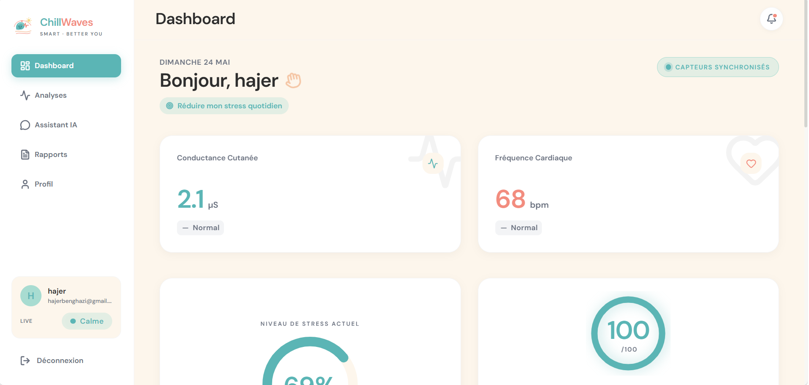
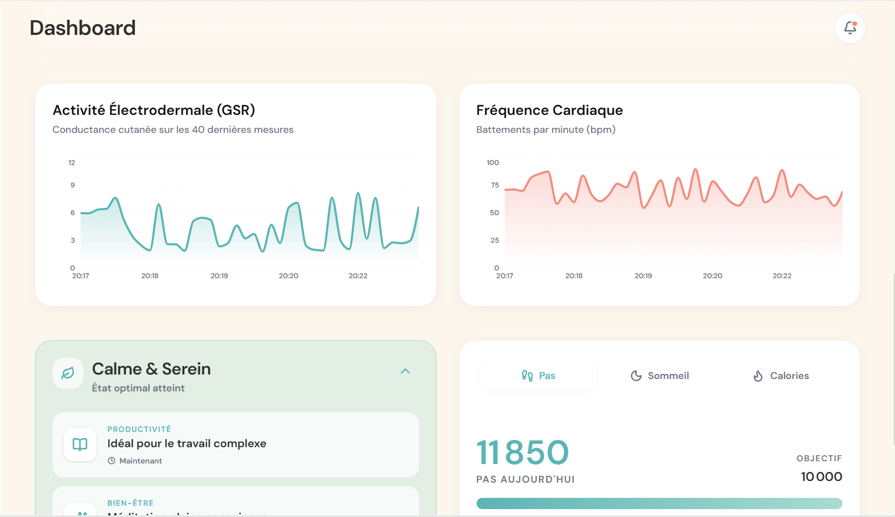
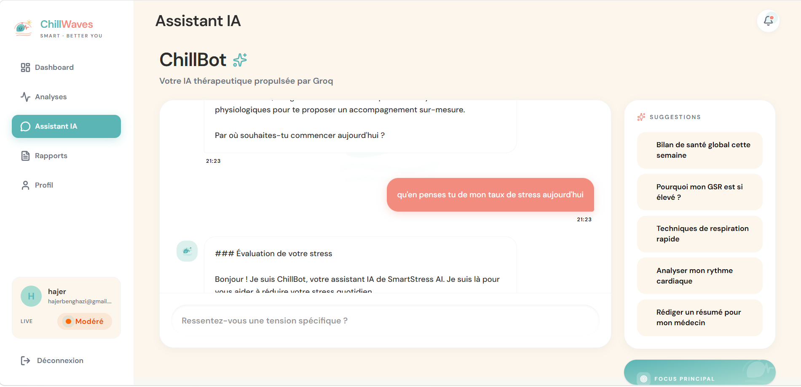
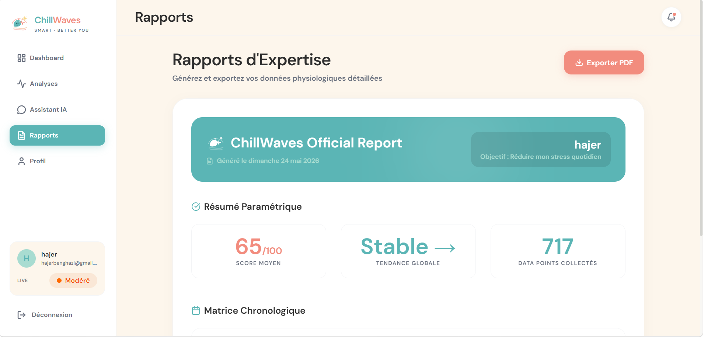

<div align="center">

# 🌊 ChillWaves — SmartStress AI

### Intelligent Real-Time Stress Monitoring System

[](https://fastapi.tiangolo.com)
[](https://react.dev)
[](https://expo.dev)
[](https://python.org)
[](https://mysql.com)
[](https://aws.amazon.com)
[](LICENSE)

**Smart monitoring. Better you.**  
An end-to-end IoT + AI platform that measures physiological stress signals in real time, classifies them using Machine Learning, and delivers personalized wellness recommendations via an AI chatbot.

[Live Demo](#) · [API Docs](#api-documentation) · [Report a Bug](issues) · [Request Feature](issues)

</div>

---

## 📋 Table of Contents

- [Overview](#-overview)
- [Features](#-features)
- [Architecture](#-architecture)
- [Tech Stack](#-tech-stack)
- [Screenshots](#-screenshots)
- [Getting Started](#-getting-started)
- [Environment Variables](#-environment-variables)
- [API Reference](#-api-reference)
- [ML Pipeline](#-ml-pipeline)
- [Deployment on AWS](#-deployment-on-aws)
- [Project Structure](#-project-structure)
- [Roadmap](#-roadmap)
- [Author](#-author)

---

## 🧠 Overview

**ChillWaves / SmartStress AI** is a final-year engineering project that tackles chronic stress — one of the most significant public health challenges of the 21st century.

Existing stress management solutions suffer from two major limitations:
- **Subjectivity** — self-reported questionnaires rely on user perception
- **Reactivity** — medical consultations happen *after* the problem, not during

ChillWaves solves this by continuously measuring **galvanic skin response (GSR)** and **heart rate (HR)** via an ESP32 IoT device, classifying stress levels in real time using a **Random Forest** model (98% accuracy), and delivering actionable recommendations through **ChillBot**, an AI therapeutic assistant powered by LLaMA-3.3-70b.

---

## ✨ Features

| Feature | Description |
|---|---|
| 📡 **Real-time monitoring** | GSR + heart rate captured every 3 seconds via ESP32 |
| 🤖 **ML Classification** | Random Forest model — 3 stress levels (Calm / Moderate / High) |
| 🔐 **JWT Authentication** | Secure register/login with bcrypt password hashing |
| 📊 **Interactive Dashboard** | Live ECG wave, stress gauge, wellness score, Recharts graphs |
| 💬 **AI Chatbot (ChillBot)** | LLaMA-3.3-70b via Groq API with physiological context injection |
| 📈 **Weekly Analytics** | Stress heatmap, daily trends, radar chart |
| 📄 **PDF Reports** | Export medical-grade reports via jsPDF |
| 📱 **Mobile App** | React Native + Expo with step counter & sleep estimation |
| 🔔 **Push Alerts** | Browser notifications on high stress detection |
| ☁️ **Cloud Ready** | Docker + AWS EC2 + RDS MySQL + S3 deployment |

---

## 🏗 Architecture

```
┌─────────────────────────────────────────────────────────────┐
│                    SENSOR LAYER (IoT)                       │
│        ESP32 + GSR Sensor + MAX30102 (Heart Rate)           │
│                    → POST /predict                          │
└──────────────────────────┬──────────────────────────────────┘
                           │ HTTP/JSON (WiFi)
┌──────────────────────────▼──────────────────────────────────┐
│                  BACKEND LAYER (Python)                     │
│              FastAPI + SQLAlchemy + MySQL                   │
│   ┌─────────┐ ┌──────────┐ ┌────────────┐ ┌────────────┐  │
│   │  Auth   │ │    ML    │ │  Readings  │ │   Sleep    │  │
│   │  JWT    │ │ Random   │ │   Stats    │ │  Estimate  │  │
│   │ bcrypt  │ │ Forest   │ │    API     │ │  (HR-based)│  │
│   └─────────┘ └──────────┘ └────────────┘ └────────────┘  │
└──────────────┬────────────────────┬────────────────────────┘
               │                    │
  ┌────────────▼───────┐  ┌─────────▼──────────────────────┐
  │   MOBILE APP       │  │        WEB DASHBOARD            │
  │  React Native      │  │   React 18 + Vite 5             │
  │  Expo SDK 54       │  │   Tailwind v4 + Recharts        │
  │  Step counter      │  │   ChillBot AI + PDF Export      │
  └────────────────────┘  └────────────────────────────────┘
```

---

## 🛠 Tech Stack

### Backend
| Technology | Version | Role |
|---|---|---|
| FastAPI | 0.115 | REST API + Swagger auto-docs |
| SQLAlchemy | 2.0 | ORM + MySQL migrations |
| MySQL (AWS RDS) | 8.0 | Production database |
| scikit-learn | latest | Random Forest ML model |
| python-jose | 3.3 | JWT token generation |
| bcrypt | 4.x | Password hashing |
| Uvicorn | 0.30 | ASGI server |

### Web Dashboard
| Technology | Version | Role |
|---|---|---|
| React | 18 | SPA framework |
| Vite | 5 | Build tool |
| Tailwind CSS | v4 | Design system (ChillWaves theme) |
| Recharts | latest | AreaChart, BarChart, RadarChart |
| React Router | v6 | Protected routes |
| jsPDF | latest | PDF report generation |

### Mobile App
| Technology | Version | Role |
|---|---|---|
| React Native | latest | Cross-platform iOS/Android |
| Expo | SDK 54 | Development platform |
| expo-sensors | latest | Accelerometer (step counter) |
| AsyncStorage | latest | JWT token + daily steps persistence |

### AI & IoT
| Technology | Role |
|---|---|
| Groq API (LLaMA-3.3-70b) | ChillBot therapeutic chatbot |
| ESP32 WROOM-32 | IoT microcontroller |
| MAX30102 | Heart rate + SpO2 sensor |
| Grove GSR | Galvanic skin response sensor |

---

## 📸 Screenshots

### Landing Page


### Dashboard — Real-time Metrics


### Stress Gauge & Wellness Score


### Live ECG Wave + Charts


### ChillBot — AI Therapeutic Assistant


### Reports & PDF Export


---

## 🚀 Getting Started

### Prerequisites

- Python 3.11+
- Node.js 18+
- MySQL 8.0 (local) or AWS RDS
- Docker & Docker Compose (optional)

### 1. Clone the repository

```bash
git clone https://github.com/hajerbenghazi/smartstress-ai.git
cd smartstress-ai
```

### 2. Backend setup

```bash
cd backend

# Create virtual environment
python -m venv venv
source venv/bin/activate  # Windows: venv\Scripts\activate

# Install dependencies
pip install -r requirements.txt

# Configure environment
cp .env.example .env
# Edit .env with your MySQL credentials and JWT secret
nano .env
```

### 3. Train the ML model (first time only)

```bash
python models/train_model.py
# Generates: models/stress_model.pkl, models/scaler.pkl, models/feature_names.json
```

### 4. Start the backend

```bash
# From project root
python -m uvicorn backend.main:app --host 0.0.0.0 --port 8000 --reload

# API available at: http://localhost:8000
# Swagger docs at:  http://localhost:8000/docs
```

### 5. Start the web dashboard

```bash
cd dashboard_pro
npm install
npm run dev
# Dashboard at: http://localhost:5173
```

### 6. Run the simulator (no ESP32 hardware needed)

```bash
python backend/simulator.py --interval 4
# Injects 1 realistic reading every 4 seconds
```

### 7. Start with Docker Compose (all-in-one)

```bash
docker-compose up --build
# Backend: http://localhost:8000
# MySQL:   localhost:3306
```

---

## 🔐 Environment Variables

Create a `backend/.env` file based on `.env.example`:

```env
# MySQL Database (AWS RDS or local)
DB_USER=smartstress
DB_PASSWORD=your_password
DB_HOST=localhost          # or your RDS endpoint
DB_PORT=3306
DB_NAME=smartstress_db

# JWT Security
# Generate with: python -c "import secrets; print(secrets.token_hex(32))"
JWT_SECRET_KEY=your_random_64_char_secret
TOKEN_EXPIRE_DAYS=30

# App
APP_ENV=development
ALLOWED_ORIGINS=http://localhost:5173
```

> ⚠️ **Never commit `.env` to Git.** It's already in `.gitignore`.

---

## 📡 API Reference

| Method | Endpoint | Auth | Description |
|---|---|---|---|
| `POST` | `/auth/register` | — | Register new user, returns JWT |
| `POST` | `/auth/login` | — | Login, returns JWT |
| `GET` | `/auth/me` | Bearer JWT | Get current user profile |
| `POST` | `/predict` | Optional | ML stress prediction + save |
| `GET` | `/readings` | Optional | Paginated reading history |
| `GET` | `/readings/latest` | Optional | Latest real-time reading |
| `GET` | `/stats/daily` | Optional | Daily stats (last N days) |
| `GET` | `/stats/weekly` | Optional | Weekly summary + trend |
| `GET` | `/sleep/estimate` | Optional | Sleep estimation via HR |
| `POST` | `/simulate` | — | Inject N simulated readings |
| `GET` | `/health` | — | System health check |

Full interactive docs available at `http://localhost:8000/docs` (Swagger UI).

---

## 🤖 ML Pipeline

The Random Forest classifier uses **14 features** extracted from GSR and heart rate signals:

```
GSR features   : mean, std, max, min, range, slope, n_peaks
HR features    : mean, std, max, min, range, rmssd
Combined       : gsr_hr_ratio
```

**Output classes:**

| Label | Class | Typical GSR | Typical HR |
|---|---|---|---|
| `0` | 😌 Calm | < 4 µS | < 70 bpm |
| `1` | 😐 Moderate | 4–8 µS | 70–90 bpm |
| `2` | 😰 High Stress | > 8 µS | > 90 bpm |

**Performance:** 98% accuracy on simulated test dataset.

---

## ☁️ Deployment on AWS

Full step-by-step guide in [`DEPLOIEMENT_AWS.md`](DEPLOIEMENT_AWS.md).

**Architecture summary:**

```
Internet → EC2 (FastAPI + Docker) → RDS MySQL
                                 ↗
S3 (React build) ───────────────
```

**Quick deploy:**

```bash
# 1. Build Docker image
docker build -t smartstress-backend .

# 2. Run with production .env (pointing to RDS)
docker run -d \
  --name smartstress_api \
  --env-file backend/.env \
  -p 8000:8000 \
  -v $(pwd)/models:/app/models \
  --restart unless-stopped \
  smartstress-backend

# 3. Build & deploy React to S3
cd dashboard_pro
npm run build
aws s3 sync dist/ s3://your-bucket-name --delete
```

---

## 📁 Project Structure

```
smartstress-ai/
│
├── backend/                    # FastAPI backend
│   ├── main.py                 # All API routes
│   ├── database.py             # MySQL models (SQLAlchemy)
│   ├── auth.py                 # JWT authentication
│   ├── ml_service.py           # ML prediction service
│   ├── schemas.py              # Pydantic schemas
│   ├── requirements.txt        # Python dependencies
│   └── .env.example            # Environment variables template
│
├── models/                     # ML model files
│   ├── train_model.py          # Training script
│   ├── stress_model.pkl        # Trained Random Forest
│   ├── scaler.pkl              # Feature scaler
│   └── feature_names.json      # Feature list
│
├── dashboard_pro/              # React web dashboard
│   ├── src/
│   │   ├── pages/              # Dashboard, Analytics, Chatbot, Reports, Profile
│   │   ├── components/         # Sidebar, MetricCard, ECGWave, StressGauge...
│   │   └── theme.css           # ChillWaves design system (Tailwind v4)
│   └── package.json
│
├── mobile/                     # React Native app (Expo)
│   ├── screens/                # Home, Analytics, Chatbot, Profile
│   └── package.json
│
├── firmware/                   # ESP32 Arduino firmware
│   └── smartstress_esp32.ino
│
├── Dockerfile                  # Backend container
├── docker-compose.yml          # Local dev with MySQL container
├── DEPLOIEMENT_AWS.md          # Full AWS deployment guide
├── .gitignore
└── README.md
```

---

## 🗺 Roadmap

- [x] FastAPI backend with JWT auth
- [x] Random Forest ML model (98% accuracy)
- [x] React web dashboard with live ECG
- [x] ChillBot AI chatbot (LLaMA-3.3-70b)
- [x] React Native mobile app
- [x] MySQL migration + Docker support
- [x] AWS deployment guide
- [ ] Physical ESP32 + MAX30102 integration
- [ ] PostgreSQL migration option
- [ ] Push notifications on mobile (expo-notifications)
- [ ] Refresh token mechanism
- [ ] Admin dashboard
- [ ] Cardiac anomaly detection (RMSSD analysis)

---

## 👩‍💻 Author

**BenGhazi Hajer**  
4th Year Computer Engineering — Faculté des Sciences de Tunis  
Université de Tunis El Manar | 2025–2026

Supervised by **M. Moez Hizem**

[](https://github.com/hajerbenghazi)
[](https://linkedin.com/in/hajerbenghazi)
[](mailto:hajerbenghazi@gmail.com)

---

<div align="center">

Made with ❤️ and a lot of ☕ — *Smart monitoring. Better you.*

</div>
